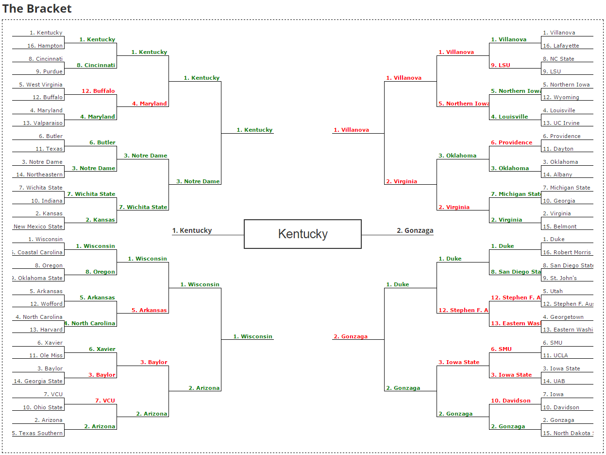

# Code Your Bracket

Algorithm to pick the NCAA March Madness Bracket using the [Code Your Bracket environment](https://codersbracket.com).

This algorithm will calculate a team's offensive efficiency using widley accepted formulas.
It will also calculate predicted turnover %, steal %, block %, and rebound %.
There is almost no way to calculate defensive efficiency of a team due to having no data 
  about a team's opponents, so we will try to predict it with the given data.
Other factors, such as randomness, seed position, rank will be taken into account later, based
  on my personal beliefs and feelings as a sports fan. 

  
### Various Stats 
----------------------------------------------------------------------
* Possesions = FGA - ORB + TO + (.4 * FTA)
* Effective Field Goal % (Offensive Efficiency) = (FG + .5 * 3FG) / FGA 
* Turnover % = 100 * (Turnovers / Possessions)
* Steal % = 100 * (Steals / OppPossesions)
* Rebounding Efficiency = OffReb / (OffReb + OppDefReb)

### Weightings for Stats
--------------------------------------
Based on Dean Oliver's "Four Factors"
* Shooting Efficiency - 40 
* RPI - 35 
* Win % - 35  
* Turnover Rate - 25 
* Rebounding - 20 
* Free Throw Conversion - 15 
* Steal % - 15 
* Block % - 15 

### Results
-------------
The final bracket and results from the tournament appear in the image below.

